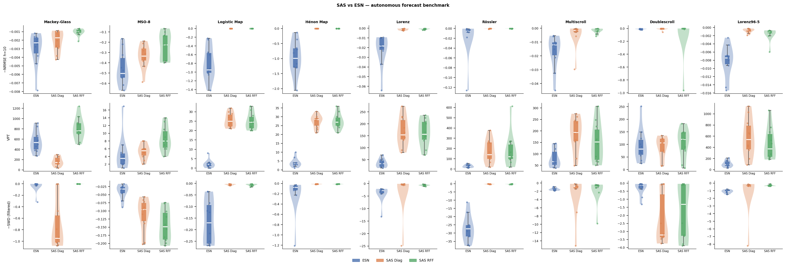

# saspy

**State Affine Systems (SAS)** reservoir computing for time-series forecasting.

The reservoir evolves as a polynomial recurrence

    s_t = P(z_t) ⊛ s_{t-1} + Q(z_t)

computed in `O(log T)` depth via a parallel associative scan in JAX.
Forecasts are produced by per-horizon ridge regression on the reservoir state.



*All metrics are higher-is-better (NRMSE and SWD are negated). See [Benchmark](#benchmark) for details.*

---

## Install

```bash
pip install -e .
```

## Quick start

```python
import numpy as np
from saspy import SASForecaster, DiagonalPoly

rng = np.random.default_rng(0)
y = np.zeros(1000)
for t in range(1, 1000):
    y[t] = 0.7 * y[t-1] + rng.normal(0, 1)

basis = DiagonalPoly(p_degree=1, q_degree=1)
model = SASForecaster(basis=basis, n_reservoir=100, washout=50)
model.fit(y[:800], horizons=[1, 5, 10])

preds = []
for t in range(800, 1000):
    preds.append(model.predict(1))
    model.update(y[t])
```
---

## Basis

The basis controls the structure of `P(z)` and `Q(z)`.

| Class | Description |
|---|---|
| `DiagonalPoly` | Diagonal `P` matrices — `O(n)` per step, fast and memory-efficient |
| `LRUBlockPoly` | Block-diagonal `P` with rotation structure — expressive, `O(n)` per step |
| `BlockLinearPoly` | Block-diagonal `P` with random orthogonal initialisation — larger blocks |
| `RandomFourierBasis` | Random Fourier feature map for kernel approximation |
| `SparsePolyBasis` | Sparse polynomial basis with explicit monomial selection |

`DiagonalPoly` and `LRUBlockPoly` are the recommended defaults.

---

## Benchmark

Models are evaluated in autonomous rollout mode (the model feeds its own predictions back as input). Three metrics are reported:

| Metric | Definition | Better |
|---|---|---|
| **NRMSE h=10** | Normalised RMSE at horizon 10, averaged over channels (negated in plot) | Lower |
| **VPT** | Steps until NRMSE exceeds 0.4. Reported in Lyapunov times (TL) for chaotic systems | Higher |
| **SWD** | Sliced Wasserstein Distance between true and predicted attractor, 200 projections (negated in plot) | Lower |

The benchmark compares three models across nine dynamical systems (Mackey-Glass, MSO-8, Logistic Map, Hénon Map, Lorenz, Rössler, Multiscroll, Doublescroll, Lorenz96-5):

- **ESN** — Echo State Network, 500 units, lr=0.25, sr=1.1
- **SAS Diag** — `DiagonalPoly`, 500 units, p=2, q=3
- **SAS RFF** — `RandomFourierBasis`, 500 units, bandwidth=0.5

To reproduce:

```bash
cd benchmarks
python main.py
```

---

## API

- `SASForecaster(basis, n_reservoir, ...)` — fit / update / predict / transform
- `DiagonalPoly(n, p_degree, q_degree, ...)` — diagonal basis
- `LRUBlockPoly(n_blocks, p_degree, q_degree, ...)` — rotation-block basis
- `BaseBasis` — abstract base for custom bases

## Tests

```bash
pip install -e ".[dev]"
pytest
```
