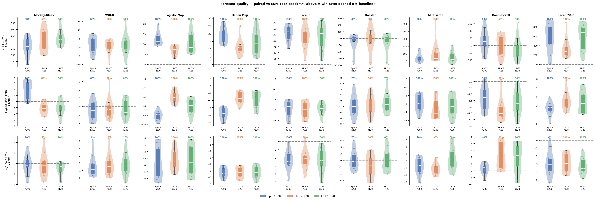

# saspy

[](https://github.com/yannKerzreho/saspy/actions/workflows/tests.yml)

**State Affine Systems (SAS)** reservoir computing for time-series forecasting.

The reservoir evolves as a polynomial recurrence

    s_t = P(z_t) ⊛ s_{t-1} + Q(z_t)

computed in `O(log T)` depth via a parallel associative scan in JAX.
Forecasts are produced by per-horizon ridge regression on the reservoir state.



*Per-seed comparison against an ESN baseline; the dashed line is the baseline and
the percentage is the win-rate. See [Benchmark](#benchmark) for details.*

---

## Install

```bash
pip install -e .
```

## Quick start

```python
import numpy as np
from saspy import SASForecaster, SASModel, DiagonalP, DiagonalQ, Cheb

rng = np.random.default_rng(0)
y = np.zeros(1000)
for t in range(1, 1000):
    y[t] = 0.7 * y[t-1] + rng.normal(0, 0.3)
y /= np.abs(y).max()          # the reservoir lives on [-1, 1]

model = SASModel(DiagonalP(100, feature=Cheb(degree=2)),
                 DiagonalQ(100, feature=Cheb(degree=2)), d=1)
fc = SASForecaster(model, washout=50)
fc.fit(y[:800], horizons=[1, 5, 10])

preds = []
for t in range(800, 1000):
    preds.append(fc.predict(1))
    fc.update(y[t])
```

A worked example on the Lorenz attractor — teacher-forced forecasts, autonomous
rollout, swapping the structure — is in [`examples/quickstart.ipynb`](examples/quickstart.ipynb).

---

## Basis

`P(z)` and `Q(z)` are chosen independently, each as a **feature** map on `[-1, 1]`
paired with a **structure** for the state matrix.

| Feature | Description |
|---|---|
| `Cheb` | Chebyshev polynomials of the driver, degree `D` |
| `Trig` | Random cosine (Fourier) features of the driver |

| Structure | Classes | Description |
|---|---|---|
| Diagonal | `DiagonalP` / `DiagonalQ` | Scalar eigenvalue per unit — `O(n)` per step, fast and memory-efficient |
| Block | `BlockP` / `BlockQ` | `B×B` blocks, rotation (LRU) or orthogonal init — `O(n)` per step |
| Sparse | `SparseP` / `SparseQ` | Sparse `n×n` recurrence with joint features over all inputs |
| LowRank | `LowRankP` / `LowRankQ` | Fixed backbone plus `R` input-driven rank-one terms |

Every feature is bounded by construction, so contractivity is enforced at
initialisation — no spectral-radius search.

---

## Benchmark

Models are evaluated in autonomous rollout mode (the model feeds its own predictions back as input). Three metrics are reported:

| Metric | Definition | Better |
|---|---|---|
| **NRMSE h=10** | Normalised RMSE at horizon 10, averaged over channels (log2 ratio to ESN in plot) | Lower |
| **VPT** | Steps until NRMSE exceeds 0.4. Reported in Lyapunov times (TL) for chaotic systems | Higher |
| **SWD** | Sliced Wasserstein Distance between true and predicted attractor, 200 projections (log2 ratio to ESN in plot) | Lower |

The benchmark compares three SAS models against an ESN baseline across nine dynamical systems (Mackey-Glass, MSO-8, Logistic Map, Hénon Map, Lorenz, Rössler, Multiscroll, Doublescroll, Lorenz96-5), on 10 seeded windows each:

- **ESN** — Echo State Network, 300 units, lr=0.25, sr=1.1
- **Sp-C3 n200** — `SparseP`/`SparseQ`, 200 units, Chebyshev degree 3
- **LR-C5 r128** — `LowRankP`/`LowRankQ`, 300 units, rank 128, Chebyshev degree 5
- **LR-T3 r128** — `LowRankP`/`LowRankQ`, 300 units, rank 128, `Trig` features

Models and systems are declared in [`benchmark/config.yaml`](benchmark/config.yaml). To reproduce:

```bash
pip install -e ".[benchmark]"
cd benchmark
python main.py
```

---

## API

- `SASForecaster(model, washout, mode, ...)` — fit / update / predict / transform.
  `mode='direct'` fits one ridge readout per horizon; `mode='autoreg'` fits the
  one-step readout and feeds predictions back for longer horizons.
- `SASModel(basis_p, basis_q, d=None, leak=1.0, ...)` — input projection plus a
  `(P, Q)` pair; `d` is the input dimension (omit it for the sparse structure,
  whose joint features already mix the inputs).
- `scan_states(P_seq, Q_seq, s0, basis, chunk_size)` — the bare parallel scan.
- `BaseForecaster` — abstract base for custom forecasters.

## Tests

```bash
pip install -e ".[dev]"
pytest
```
